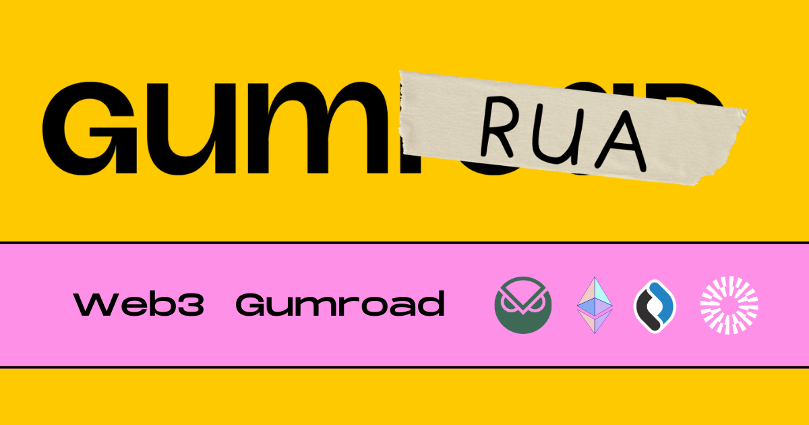

## Web3 Gumroad.

[Gumraod](https://gumroad.com/) is the easiest way to sell digital content.

It's popular because of its simplicity.

We recreated with Gumroad with crypto at its core with the top priority being UX and simplicity for new users to onboard the next billion into web3.

#### How it works:

1. Provide a file + cover image + name + price;
2. Receive Link
3. Share link
4. Receive Sales 🎉

#### Tech Stack:

React Framework:  
[NextJS](https://nextjs.org/)

Deployment:  
[Vercel](https://vercel.com/)

File Storage (web2):  
[Supabase](https://supabase.com/)

Authentication:  
[SIWE - Sign In With Ethereum](https://docs.login.xyz/integrations/nextauth.js)  
[@rainbow-me/rainbowkit-siwe-next-auth](https://www.npmjs.com/package/@rainbow-me/rainbowkit-siwe-next-auth)  
[next-auth](https://next-auth.js.org/)

Smart Contract Interaction Client Side:  
[Wagmi](https://wagmi.sh/)

Smart Contract Interaction Server Side:  
[Ethers.js](https://docs.ethers.org/v5/)

Wallet Connection:  
[Rainbowkit](https://www.rainbowkit.com/)

Smart Contract Developement Framework:  
[Hardhat](https://hardhat.org/)

NFT Standard:  
[EIP 1155](https://eips.ethereum.org/EIPS/eip-1155)

Blockchain:  
[Gnosis](https://www.gnosis.io/)
